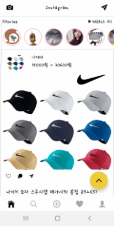

## Awesome Instagram UI Clone App

인스타그램 UI를 Clone한 앱입니다. 내부 데이터는 네이버 쇼핑 검색 api, pixabay, steemit 데이터를 사용하였습니다.
[https://busy.org/@anpigon/react-native-ui-1](https://busy.org/@anpigon/react-native-ui-1) 해당 블로그를 참고하였습니다.

---

## 기술 스택

- react
- react-native
- react-hook
- @testing-library/jest
- typescript

---

## 시작하기

1. npm install
2. 프로젝트 루트에 .env 파일 생성. [네이버 오픈 api](https://developers.naver.com/apps/#/register) 프로젝트 생성 후 NAVER_CLIENT_ID, NAVER_CLIENT_SECRET 정보 저장. [pixabay](https://pixabay.com/service/about/api/) 계정 생성 후 PIXABAY_KEY에 key 저장

`ex. NAVER_CLIENT_ID=YK34Hnhr NAVER_CLIENT_SECRET=BKK3gkerg4 PIXABAY_KEY=2348932-g4383kyhh`

3. npm start

---

## 프로젝트 사진

